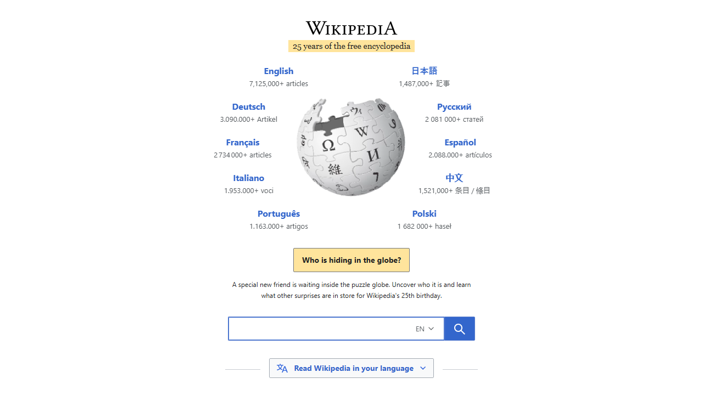

# 🛡️ QrShilde Security Audit Report
**Date:** 2026-02-21 18:22:05 | **ID:** 20260221_182118
## 📊 Verdict: SAFE (0/100)

### 🔍 Findings:

### 📸 Site Evidence:

### 🤖 AI Analysis:
**Security Verdict: SAFE**

**Analysis:**
*   **Target URL:** `https://www.wikipedia.org`
*   **Attacks:** None identified. The destination is a well-known, high-reputation informational site.
*   **Risks:** Negligible. The site uses HTTPS (TLS encryption), ensuring the integrity and confidentiality of the connection.
*   **Obfuscation:** None. The URL is transparent, uses no shortening services (e.g., bit.ly), and contains no homograph (look-alike character) tricks or encoded characters.

**Conclusion:** This is a benign link to a legitimate domain.

---
**Payload:** `https://www.wikipedia.org`