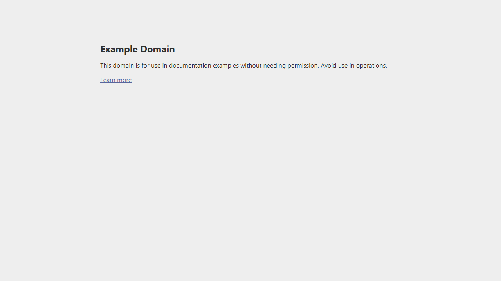

# 🛡️ QrShilde Security Audit Report
**Date:** 2026-02-26 23:29:54 | **ID:** 20260226_232944
## 📊 Verdict: SAFE (5/100)

### 🔍 Findings:
- ⚠️ Payload type: url
- ⚠️ Allowlist: trusted/known domain detected (example.com)
- ⚠️ ML: Gray-zone suspicious (p=0.32 >= t=0.31) -> needs AI confirmation

### 📸 Site Evidence:

### 🧠 ML Result:
- Label: **phishing**
- Phishing Probability: **0.3244**
- Threshold: **0.31**

**Top ML signals:**
- special_count: 2.6577
- keyword_hits: -1.4821
- tld_len: -1.1857
- path_len: -0.5963
- host_len: 0.0790

### 🤖 AI Analysis:
**Summary:** The URL points to example.com, which is a reserved domain established by the IETF for documentation and illustrative purposes. While the path structure suggests a login or account update page, the domain cannot host functional malicious content or live services.

**Suspicious signals:**
- Use of unencrypted HTTP protocol
- URL path includes sensitive keywords ('login', 'update') often associated with credential harvesting

**Benign signals:**
- The domain 'example.com' is a globally recognized placeholder domain for documentation (RFC 2606)
- The domain is not a functional website for processing user data

**Recommendation:** Recognize this as a documentation or test URL. No action is required as the domain is non-functional for real-world transactions.

---
**Payload:** `http://example.com/login/update`